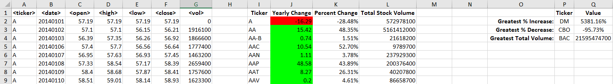
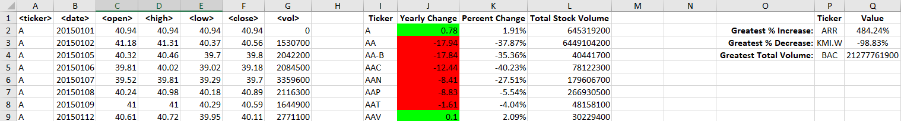
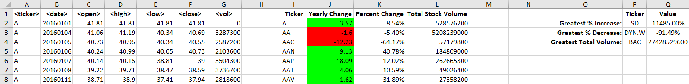

# The VBA of Wall Street

### Contents:

		/Code - script file "Stonks.vb" containing the macro to summarize the stock data

		/Resources - excel files for script testing and for the final script run

		/Images - screenshots to show a blip of each year of data

### Objective:

- For Loop to read the ticker column to determine the beginning and end of a ticker group. 

	If the next row doesn't match the current row, then
	
		- Write the ticker symbol to the I column
		
		- Calculate the yearly change by subtracting the yearly close from the first day open
		
		- Calculate the percentage of the change by dividing the change by the first day open
		
		- Format the yearly change and percent change to red or green based on positive or negative
		
		- Get the sum of the stock volume for every day it was traded.
		
- Loops to next ticker group and repeats the steps above until all ticker groups have been written

### Bonus:

- After the loop has completed, we read the summary columns to determine the Greatest % Increase, Greatest % decrease, and Greatest Total Volume

- The script allows us to go through all the sheets by running once.

### 2014:

### 2015:

### 2016:

